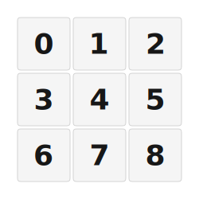

# ZMK Configuration for Macropad3x3

*Generated by Shield Wizard for ZMK*



Download compiled firmware from the Actions tab. <https://zmk.dev/docs/user-setup#installing-the-firmware>

Edit your keymap <https://zmk.dev/docs/keymaps>.
User keymap is located at [`config/macropad3x3.keymap`](config/macropad3x3.keymap).

-----

<details>
<summary>
Shield Wizard Debug Information
</summary>

In case of broken configuration, here is the Shield Wizard internal data used to generate this configuration:

Commit: 8a52249f61161469b6d90ed8c80c4aa52b9f3858

```json
{"name":"Macropad3x3","shield":"macropad3x3","dongle":false,"modules":[],"layout":[{"id":"01KGWXSDX2S8D7NJV7317DB1D9","part":0,"row":0,"col":0,"w":1,"h":1,"x":0,"y":0,"r":0,"rx":0,"ry":0},{"id":"01KGWXSF5G1HNFJVSMQQS2CJWE","part":0,"row":0,"col":1,"w":1,"h":1,"x":1,"y":0,"r":0,"rx":0,"ry":0},{"id":"01KGWXSH5K2NNTWCR5A5HCZ7WG","part":0,"row":0,"col":2,"w":1,"h":1,"x":2,"y":0,"r":0,"rx":0,"ry":0},{"id":"01KGWXSFZ3447Q8JZVM2N7PVG0","part":0,"row":1,"col":0,"w":1,"h":1,"x":0,"y":1,"r":0,"rx":0,"ry":0},{"id":"01KGWXV2W21MV788RQ1G3FWK9Y","part":0,"row":1,"col":1,"w":1,"h":1,"x":1,"y":1,"r":0,"rx":0,"ry":0},{"id":"01KGWXW7G8M7B06PGAXHW9VWGC","part":0,"row":1,"col":2,"w":1,"h":1,"x":2,"y":1,"r":0,"rx":0,"ry":0},{"id":"01KGWXW8X89XQ7J8N31RZDH7P7","part":0,"row":2,"col":0,"w":1,"h":1,"x":0,"y":2,"r":0,"rx":0,"ry":0},{"id":"01KGWXW97GZCBB8K9ET5FBTXBW","part":0,"row":2,"col":1,"w":1,"h":1,"x":1,"y":2,"r":0,"rx":0,"ry":0},{"id":"01KGWXWA3S92ZB10BG4J12YFAF","part":0,"row":2,"col":2,"w":1,"h":1,"x":2,"y":2,"r":0,"rx":0,"ry":0}],"parts":[{"name":"unibody","controller":"nice_nano_v2","wiring":"matrix_diode","pins":{"d1":"bus","d2":"bus","d3":"bus","d4":"output","d5":"output","d6":"output","d7":"input","d8":"input","d9":"input"},"keys":{"01KGWXSDX2S8D7NJV7317DB1D9":{"input":"d7","output":"d4"},"01KGWXSF5G1HNFJVSMQQS2CJWE":{"input":"d8","output":"d4"},"01KGWXSH5K2NNTWCR5A5HCZ7WG":{"input":"d9","output":"d4"},"01KGWXSFZ3447Q8JZVM2N7PVG0":{"input":"d7","output":"d5"},"01KGWXV2W21MV788RQ1G3FWK9Y":{"input":"d8","output":"d5"},"01KGWXW7G8M7B06PGAXHW9VWGC":{"input":"d9","output":"d5"},"01KGWXW8X89XQ7J8N31RZDH7P7":{"input":"d7","output":"d6"},"01KGWXW97GZCBB8K9ET5FBTXBW":{"input":"d8","output":"d6"},"01KGWXWA3S92ZB10BG4J12YFAF":{"input":"d9","output":"d6"}},"encoders":[],"buses":[{"name":"spi0","devices":[{"type":"niceview","cs":"d1"}],"type":"spi","mosi":"d2","miso":"","sck":"d3"},{"name":"spi1","devices":[],"type":"spi"},{"name":"spi2","devices":[],"type":"spi"},{"name":"spi3","devices":[],"type":"spi"},{"name":"i2c0","devices":[],"type":"i2c"},{"name":"i2c1","devices":[],"type":"i2c"}]}]}
```

</details>
